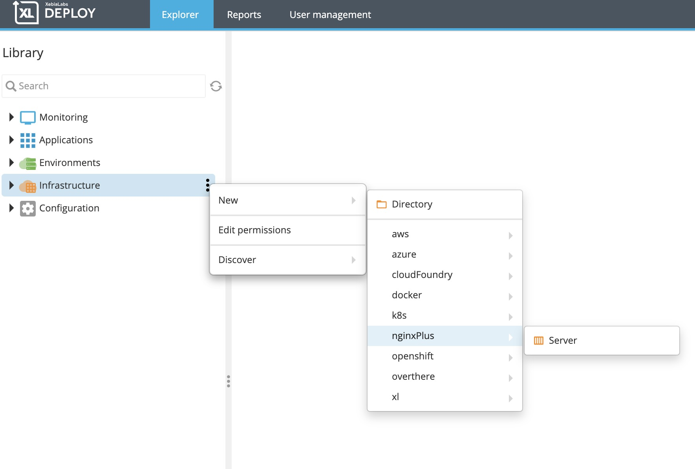
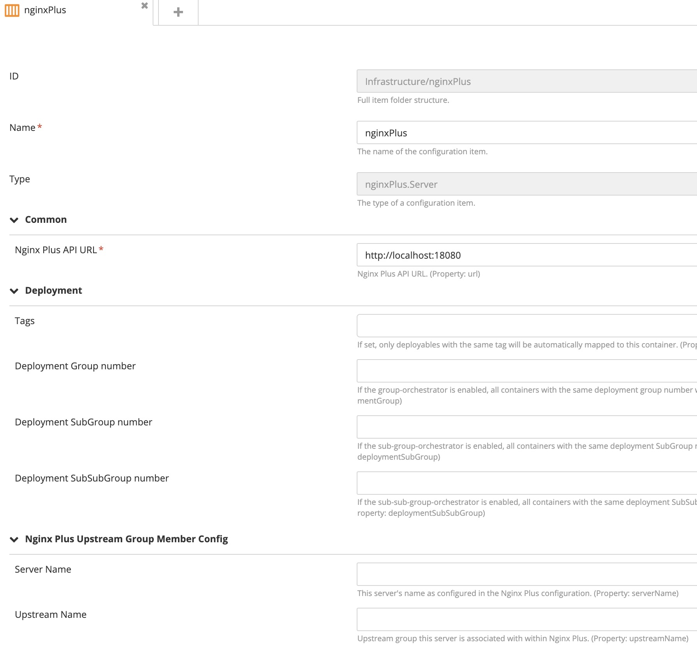
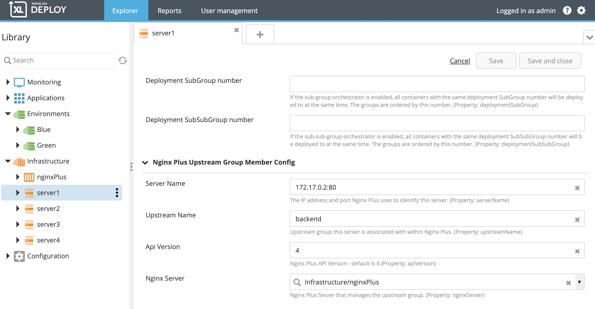
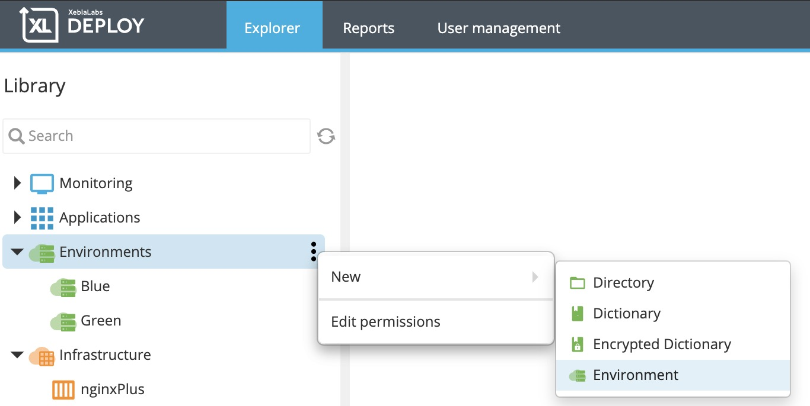
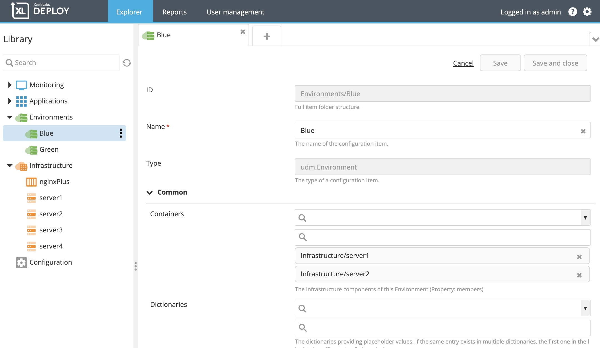
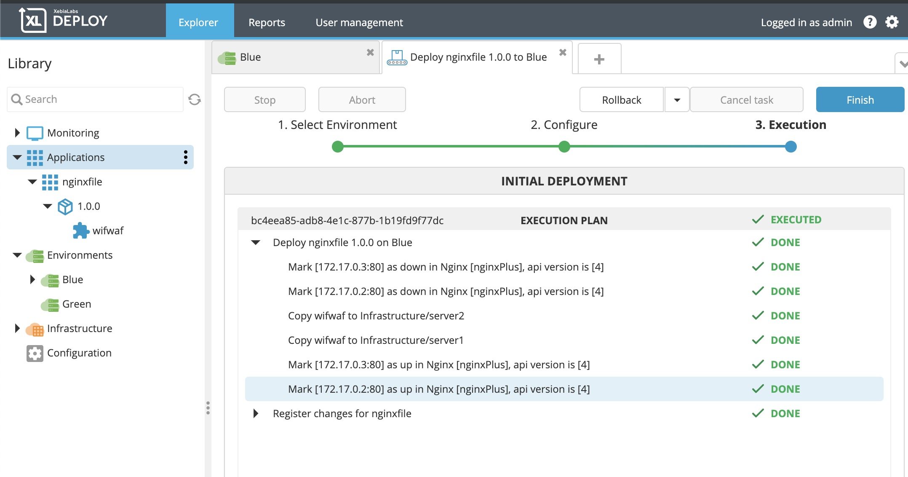

# XL Deploy Nginx Plus plugin

[![Build Status][xld-nginx-plus-plugin-travis-image]][xld-nginx-plus-plugin-travis-url]
[![Codacy Badge][xld-nginx-plus-plugin-codacy-image]][xld-nginx-plus-plugin-codacy-url]
[![Codeclimate Badge][xld-nginx-plus-plugin-codeclimate-image]][xld-nginx-plus-plugin-codeclimate-url]
[![License: MIT][xld-nginx-plus-plugin-license-image]][xld-nginx-plus-plugin-license-url]
![Github All Releases][xld-nginx-plus-plugin-downloads-image]

## Preface

This document describes the functionality provided by the xld-nginx-plus-plugin. The purpose of the plugin is to support basic Nginx Plus blue-green functionality. 
  
See the [XL Deploy reference manual](https://docs.xebialabs.com/xl-deploy) for background information on XL Deploy and deployment automation concepts.   

## Overview

This plugin adds the Nginx Plus Server type to XL Deploy and makes it possible to designate other servers as being part of a an Nginx Plus Upstream Group.
During the execution of a deployment to servers associated with an XL Deploy environment, the plugin will add the following steps to the deployment process:

 1. The Nginx Plus server is queried to retrieve the Nginx Plus IDs of all environment containers (servers) that are also members of the Nginx upstream group.
 2. For each environment container (server) that is also a member of the upstream group, the plugin updates the Nginx Plus upstream member server's 'down' attribute to 'true'. Nginx Plus will stop directing traffic to these servers.
 3. After all servers have been marked as 'down', deployment takes place.
 4. When deployment is complete, all servers previously marked down will be marked up by setting their 'down' attribute to 'false'.

Members of an Nginx Plus upstream group can be divided into a Blue environment and a Green environment within XL Deploy. XL Deploy can then deploy to one environment at a time while Nginx Plus ensures that end user traffic is never directed to a server that is in the process of being updated. 

* **Requirements**
   * **XL Release** 8.6.1+
   * **Nginx Plus that supports Nginx Plus API** v4

## Installation

  * Copy the latest JAR file from the [releases page](https://github.com/xebialabs-community/xld-nginx-plus-plugin/releases) into the `XL_DEPLOY_SERVER/plugins` directory.
  * Restart the XL Deploy server.

## Usage

### Configure Nginx Plus Server

Begin by configuring an Nginx Plus Server.  

Note: This is the Nginx Plus Server and not a member of the Nginx Plus Upstream Group. Leave the Upstream Group configuration section empty.

### Configure servers that are members of an Nginx Plus upstream group

#### Server Name

Enter the IP address and port number Nginx Plus uses to identify this server.

#### Upstream Group Name

Enter the Nginx Plus upstream group name that this server is part of. 

#### API Version

Default value is 4. It is possible that the plugin will function properly with lower versions, though this has not been tested. 

#### Nginx Plus Server

Use the drop down to choose the Nginx Plus Server previously configured in XL Deploy. 

### Create Blue and  Green Environments in XL Deploy

Divide the upstream group members, adding some as containers in the Blue environment and the rest as containers in the Green environment. 

### Deploy to each Environment

Example of a successful deployment, showing steps:

## References

[https://demo.nginx.com/swagger-ui/](https://demo.nginx.com/swagger-ui/)

[https://nginx.org/en/docs/http/ngx_http_api_module.html](https://nginx.org/en/docs/http/ngx_http_api_module.html)

[xld-nginx-plus-plugin-travis-image]: https://travis-ci.org/xebialabs-community/xld-nginx-plus-plugin.svg?branch=master
[xld-nginx-plus-plugin-travis-url]: https://travis-ci.org/xebialabs-community/xld-nginx-plus-plugin
[xld-nginx-plus-plugin-codacy-image]: https://api.codacy.com/project/badge/Grade/9fc1287ae6e64835ab2ea1696a9064c3
[xld-nginx-plus-plugin-codacy-url]: https://www.codacy.com/app/ladamato/xld-nginx-plus-plugin?utm_source=github.com&amp;utm_medium=referral&amp;utm_content=xebialabs-community/xld-nginx-plus-plugin&amp;utm_campaign=Badge_Grade
[xld-nginx-plus-plugin-codeclimate-image]: https://api.codeclimate.com/v1/badges/2a6a489b550a2f6daa8a/maintainability
[xld-nginx-plus-plugin-codeclimate-url]: https://codeclimate.com/github/xebialabs-community/xld-nginx-plus-plugin/maintainability
[xld-nginx-plus-plugin-license-image]: https://img.shields.io/badge/License-MIT-yellow.svg
[xld-nginx-plus-plugin-license-url]: https://opensource.org/licenses/MIT
[xld-nginx-plus-plugin-downloads-image]: https://img.shields.io/github/downloads/xebialabs-community/xld-nginx-plus-plugin/total.svg
